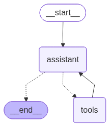

# GRAPH


# OUTPUT


# RESOURCES
LangGraph Redis https://github.com/redis-developer/langgraph-redis


MongoDB MCP Server https://github.com/mongodb-js/mongodb-mcp-server


# How to Install and Run
1. Clone the repository

2. Install dependencies
```bash
pip install -r requirements.txt
```

3. Start Redis container
```bash
docker start redis-stack
# Or create if first time:
docker run -d --name redis-stack -p 6379:6379 -p 8001:8001 redis/redis-stack:latest
```

3. Set up environment variables
```bash
GOOGLE_API_KEY=your_google_api_key_here
REDIS_URL=redis://localhost:6379
```

4. Run the application
```bash
py main.py
```
