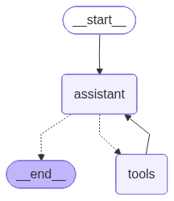

# BULWARK
A specialized agentic system that bridges the gap between natural language input and structured ERP environments. By sitting between the user and the Odoo database, it ensures that every invoice, partner, and transaction is parsed, cross-referenced, and human-verified before reaching the ledger.

## CORE FEATURES
Odoo Integration: Native communication with Odoo models (res.partner, account.move) using the XML-RPC protocol for searching, reading, and creating records.

Stateful Orchestration: Managed via LangGraph, providing a persistent, non-linear flow that allows the agent to verify vendor existence and check for duplicate invoices in real-time.

Human-in-the-Loop (HITL): Implements a critical breakpoint before the tool-execution layer. The system pauses to show the user exactly what will be written to Odoo, requiring a (yes/no) confirmation to proceed.

Structured Extraction: Leverages Pydantic and Gemini's structured output to ensure financial data (Amounts, Tax, Currency) is type-safe before it ever hits the ERP server.

Persistent Memory: Integrated with Redis to maintain conversation context and "pending" transaction states across different sessions.


## Tech Stack
Framework: LangGraph (StateGraph)

ERP Layer: Odoo

Persistence: Redis (Async Checkpointer)

Validation: Pydantic

Observability: LangSmith / DeepEval


## The Workflow
1. Ingestion: The user describes a transaction (e.g., "Invoice from Azure Interior for ₹50,000").

2. Validation: The agent searches Odoo to verify the vendor.

3. The Bulwark Gate: If the vendor is found, the graph hits an interrupt. It displays the extracted Odoo-ready data (Partner ID, Amount, Date).

4. Commit: Upon user approval, the agent executes models.execute_kw to create the invoice record in the Odoo database.


### Roadmap
[ ] Automated Gmail Sync: Transition from manual input to automated monitoring of "Accounts Payable" email folders.

[ ] Slack MCP Integration: Move approval gates from the terminal to a dedicated Slack channel using the Model Context Protocol.

[ ] Multi-ERP Support: Abstracting the model layer to support ERPNext alongside Odoo.

[ ] Complex Matching: Implementing 3-way matching between Invoices, Purchase Orders, and Inventory.


## GRAPH



## AGENT


## RESOURCES
LangGraph Redis https://github.com/redis-developer/langgraph-redis

A quick guide on LLM Evaluation Metrics https://www.confident-ai.com/blog/llm-evaluation-metrics-everything-you-need-for-llm-evaluation


## How to Install and Run
1. Clone the repository

2. Install dependencies
```bash
pip install -r requirements.txt
```

3. Set up environment variables
   
4. Initialize the Docker Stack
```bash
docker-compose up -d
```

5. Run the application
```bash
py main.py
```

6. Connect to LangSmith (Optional but Recommended for Observability)
